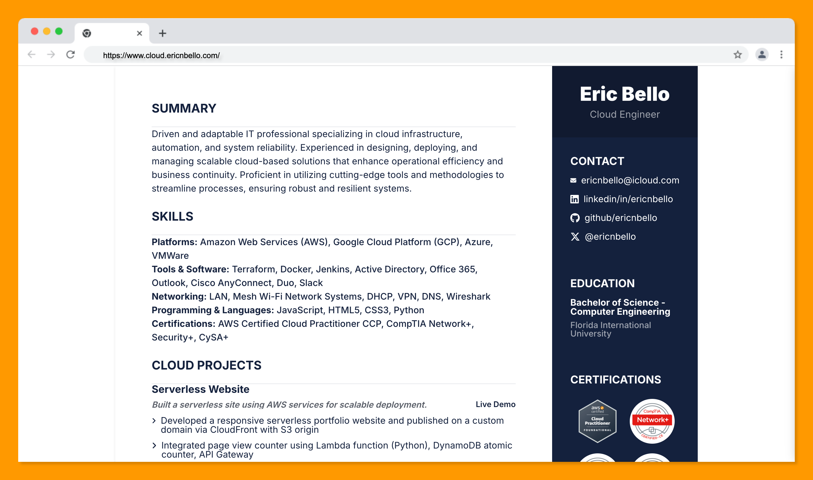

# Serverless Resume Website Project

## Overview
I built a **serverless website** using **Next.js** and **Tailwind CSS**, hosted on **AWS** with a custom domain. The website features a **visitor counter** powered by **Amazon DynamoDB** and **Lambda**, and all resources were created using the **AWS SAM CLI** and **CloudFormation**. Continuous integration and deployment (CI/CD) were set up with **GitHub Actions**, and the site is deployed via **CloudFront**.

## Technologies Used
- AWS: S3, CloudFront, DynamoDB, Lambda, API Gateway, SAM CLI, CloudFormation
- Next.js, Tailwind CSS
- GitHub Actions (CI/CD)
- Python (for Lambda)

## Blog Post

This challenge was taken from [cloudresumechallenge.dev](https://cloudresumechallenge.dev), requiring the application of various AWS services in a practical, hands-on experience to deploy a serverless website.

After passing the **AWS Certified Cloud Practitioner** exam, I was ready to apply my knowledge to some practical experience. Researching cloud projects online led me to the **Cloud Resume Challenge**, which involved deploying a serverless website using several AWS services. I began by customizing my resume website (built with **Next.js** and **Tailwind**) and deploying it without using services like Netlify or Heroku. Below are the steps I followed to complete the challenge.

### 1. Deploy the Resume Website on Amazon S3
I deployed the website as a static site using **Amazon S3**, which hosts the source code (HTML, CSS, and images) in an S3 bucket. The site was made publicly accessible by configuring the appropriate website endpoint in the `us-east-1` region.

### 2. Enable HTTPS with CloudFront
Since S3-hosted sites don’t come with SSL/TLS certificates by default, I used **CloudFront** as a content delivery network (CDN) to enable **HTTPS**. The S3 bucket served as the CloudFront origin, allowing secure access to the website.

### 3. Custom Domain Setup
I wanted the website to be accessible via my custom domain (`cloud.ericnbello.com`). I chose to manage my DNS records through **Cloudflare** instead of **Route 53**, as I was already familiar with the former. I pointed my domain to the CloudFront distribution, received an SSL certificate, and successfully hosted the website on my custom domain.

### 4. Visitor Counter
I built a simple **JavaScript visitor counter** component in Next.js, displaying it in the footer of the site. The counter uses a slim border design to highlight the count.

### 5. Storing Visitor Count in DynamoDB
The visitor count is stored in **Amazon DynamoDB**, a NoSQL database. I used an on-demand pricing plan to take advantage of AWS Free Tier. I created a table with a partition key and a `Quantity` attribute to store and update the count.

### 6. Python Lambda Function and API Gateway
To connect the visitor counter to the DynamoDB database, I created a **Python Lambda function** that communicates with the database via **Amazon API Gateway**. Using **boto3**, the function updates the visitor count in DynamoDB. I resolved **CORS** issues to ensure smooth interaction between the website and the database.

### 7. Infrastructure as Code with AWS SAM CLI and CloudFormation
I managed infrastructure setup using **Infrastructure as Code (IaC)** via **AWS CloudFormation** and the **SAM CLI**. This automated the creation of resources, including DynamoDB, API Gateway, and Lambda, making deployment easier and reducing manual configuration errors.

### 8. Version Control with GitHub
The source code for both the front-end and back-end is version-controlled via **GitHub**.

### 9. CI/CD with GitHub Actions
I automated the deployment process using **GitHub Actions**, setting up **CI/CD pipelines** for both the front and back end. Changes to the site are automatically deployed to S3, and CloudFormation updates the necessary AWS resources. I also ensured the CloudFront cache is invalidated with every update to reflect the latest changes.

### Final Thoughts
Completing the **Cloud Resume Challenge** enhanced my knowledge of AWS, web development, automation, and infrastructure as code. The project involved working with **HTML/CSS**, AWS services, JavaScript (React), database integration, and CI/CD pipelines. This experience has prepared me to take on future roles as a developer, cloud engineer, or DevOps professional, applying my newly acquired skills to deliver professional-grade solutions.
